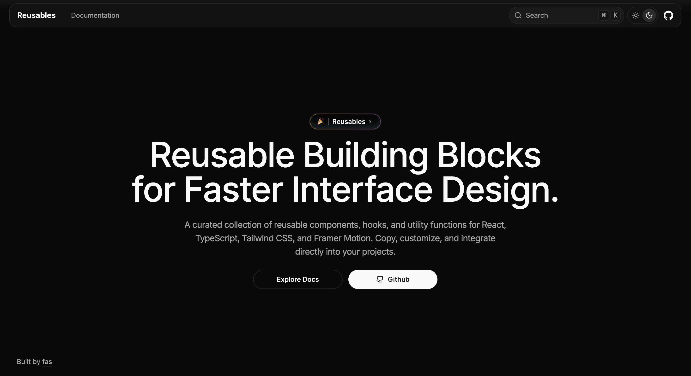

# Reusables

A collection of production-ready components, hooks, and utilities that you can seamlessly integrate into your applications.

## Overview

Reusables is **NOT** just another component library. It's a carefully curated collection of building blocks that developers can copy, paste, and adapt for their specific needs. Think of it like Shadcn UI but with more than just components.

## Features

- **Components**: Production-ready UI components
- **Hooks**: Reusable React hooks for common functionalities
- **Utilities**: Helper functions and utilities
- **Copy & Paste**: Use what you need, how you need it
- **CLI Installation**: Optional CLI for direct installation
- **Zero Dependencies**: No unnecessary package bloat

## Usage

### Method 1: Copy & Paste

Browse the collection and copy the code you need directly into your project.

### Method 2: CLI Installation

## Setup

- Built with Next.js
- Styled using Tailwind CSS
- Uses Shadcn CLI for component installation
- FumaDocs for documentation

## Documentation

Visit [Reusables Docs](https://reusables.vercel.app/docs) to view the documentation and see what we have for you.
